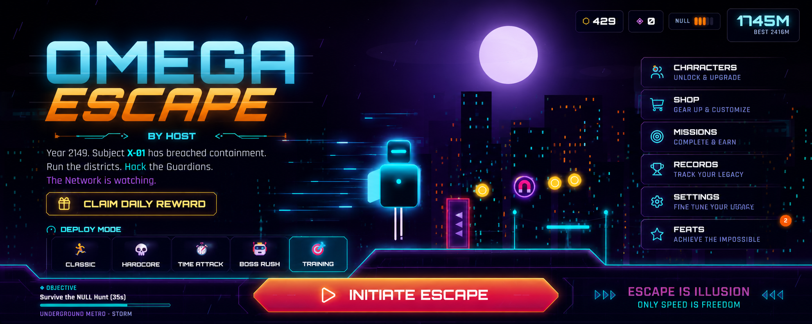

<p align="center">
  
</p>

<p align="center">
  <b>Escape the Network. Rewrite your destiny.</b><br>
  A cinematic cyberpunk endless runner where the city itself is hunting you.
</p>

<p align="center">
  
  
  
  
  
  
</p>

<p align="center">
  <a href="#-play-now"><b>Play</b></a> ·
  <a href="#-features"><b>Features</b></a> ·
  <a href="#-characters"><b>Characters</b></a> ·
  <a href="#-controls"><b>Controls</b></a> ·
  <a href="#-tech"><b>Tech</b></a> ·
  <a href="#-deploy"><b>Deploy</b></a>
</p>

---

## 🎮 Play Now

> **Live demo:** _add your URL here once deployed_ — see [Deploy](#-deploy) for a 2-minute setup.

**Or run it locally:**

```bash
npm install
npm run dev
```

**Or build a single self-contained file:**

```bash
npm run build
```

Then just **double-click `dist/index.html`**. Everything — all JavaScript, CSS, and the entire game — is inlined into one ~425 KB file. No server needed.

> [!WARNING]
> **Don't open the source `index.html` with VS Code Live Server.** Static servers can't compile TypeScript, so the game will hang on the boot screen. Use `npm run dev` or the built `dist/index.html` instead. *(The boot screen detects this and tells you.)*

---

## ▸ About

Year 2149. The Omega Corporation controls every citizen through **NULL** — a supreme surveillance AI. You broke containment.

**OMEGA ESCAPE** is not just an endless runner. It's a cinematic escape through an AI-controlled megacity where every run tells a story. As you push deeper, NULL's **threat level escalates** — billboards change, sirens wake, the streets bleed red, and the AI speaks to you directly.

Built entirely with **Canvas 2D + React**. No game engine. No sprite sheets. No audio files. Every visual is drawn procedurally and every sound is synthesized live with the Web Audio API.

---

## ▸ Features

### Core Gameplay
| | |
|---|---|
| **Advanced movement** | Jump · Double Jump · Triple Jump · Wall Jump · Wall Slide · Slide · Dash · Air Dash |
| **Responsive controls** | Coyote time, jump buffering, and a fixed 120 Hz physics timestep so collisions never tunnel |
| **Procedural levels** | 9 hand-tuned obstacle patterns with anti-repetition, reachability validation, and speed-scaled spacing |
| **Perfect dodges** | Skim an obstacle to trigger slow-motion, a combo bonus, and a burst of style |
| **Per-run objectives** | 7 randomized mini-missions (data cores, perfect dodges, no-hit streaks, survival…) |
| **5 game modes** | Classic · Hardcore · Time Attack · Boss Rush · Training |

### The NULL Threat System
NULL escalates from **Threat 1 → 5** as you run. At high threat the entire city turns hostile: sustained red tint, constant screen glitches, faster hunts, and direct AI taunts.

```
◤ NULL: I see you, Subject.
◤ ALERT: Containment breach — sector sweep.
◤ NULL: There is no exit. Only me.
```

Story is delivered entirely in-run through radio broadcasts, hidden logs, memory fragments, and environmental detail — no cutscenes, no walls of text.

### Living World
Flying cars with light trails · passing metro trains · animated neon billboards · steam vents · bird flocks · street lamps · power cables · electrical sparks — **nothing is static.**

**7 dynamic weather states** (clear, rain, storm, fog, snow, heatwave, sunrise) and **6 districts** with unique palettes that transition live as you run.

### Boss Encounters
Every **2000 m**, an Omega Guardian deploys. Drain its HP by collecting **hack-cores** mid-fight while dodging missile barrages. Cracked armor states, a defeat fanfare, and a reward chest.

### Progression & Meta
XP and levels · daily + weekly missions · 12 achievements · daily reward streaks · top-10 local leaderboard · cosmetics-only shop (skins, trails, hoverboards) · 500 m milestone checkpoints.

### Game Feel
Hit-pause · screen flash · camera shake · look-ahead camera · vertical jump follow · cinematic dash zoom · squash-and-stretch · idle breathing · landing shockwaves · coin-fly-to-HUD · adaptive music intensity.

---

## ▸ Characters

Six playable operatives. **Each is recognizable by silhouette alone** and genuinely changes how the game plays.

| | Operative | Role | Ability | Passive | Signature VFX |
|:--:|---|---|---|---|---|
| 🔵 | **NEX** | The Runner | **Time Dash** — bends time while dashing | Momentum — fastest acceleration | Cyan speed streaks, flowing scarf |
| 🟣 | **ZARA** | The Hacker | **Drone Hack** — drones drop credits instead of harming | EMP Resistance — immune to electric hazards | Holo pixels, orbiting companion drone |
| 🟪 | **VOID** | The Shadow | **Phase Dash** — pass through all obstacles | Critical Escape — survives one lethal hit / 40 s | Purple shadow smoke, tattered cloak |
| 🔷 | **RIFT** | The Rebel | **Overdrive** — dash grants speed + invincibility | Adrenaline — +8% base speed | Electric arcs, energy fist |
| 🟡 | **LUNA** | The Scout | **Triple Jump** — a third mid-air jump | Featherlight — reduced gravity, floats longer | Yellow jet trail, bunny-ear antennae |
| 🟠 | **ATLAS** | The Tank | **Energy Shield** — starts shielded, regenerates | Plated Armor — bonus coins on smashes | Ground shockwaves, heavy shoulder pads |

Each character has a distinct **jump height, gravity, acceleration curve, body build, and landing weight** — plus signature skins, lore, faction, and a voice line.

---

## ▸ Screenshots

### Home


### Gameplay


### Character Selection


### Training Mode


### Boss Fight


### Mobile


---

## ▸ Controls

### Keyboard
| Key | Action |
|---|---|
| `Space` / `W` / `↑` | Jump · Double Jump · Wall Jump |
| `S` / `↓` | Slide *(hold to stay low)* |
| `Shift` / `D` | Dash · Air Dash |
| `Esc` / `P` | Pause |

### Touch
Fully customizable on-screen controls — **adjustable size and opacity**, **left-handed mode**, and an optional **swipe-gesture mode** (tap = jump, swipe down = slide, hold = dash). Multi-touch safe with generous hit targets and safe-area padding for notched devices.

---

## ▸ Accessibility & Performance

- **4 graphics presets** — Low / Medium / High / Ultra
- **Automatic quality downgrade** if sustained FPS drops below 45
- **Low-end device auto-detection** on first launch
- **Colorblind mode** — hazards shift to orange with dashed patterns
- **Reduced motion**, **screen shake toggle**, **UI scaling** (S/M/L)
- **Independent music & SFX volume** sliders
- **Haptic feedback** toggle
- Targets **60 FPS minimum**, supports **120 FPS**

Optimized with object pooling, cached gradients, guarded shadow rendering, DPR capping, throttled menu rendering, and a fixed-timestep simulation.

---

## ▸ Tech

| Layer | Stack |
|---|---|
| **Rendering** | Canvas 2D — every sprite, particle, and effect drawn procedurally |
| **Audio** | Web Audio API — fully synthesized SFX, adaptive soundtrack, ambience. **Zero audio files.** |
| **UI** | React 19 + Tailwind CSS 4 |
| **Language** | TypeScript 5.9 (strict) |
| **Build** | Vite 7 + `vite-plugin-singlefile` |
| **Icons** | lucide-react |

### Project structure

```
Omega-Escape/
├── .github/workflows/deploy.yml   # auto-deploy to GitHub Pages
├── assets/
│   ├── branding/
│   │   ├── Banner.png
│   │   ├── Logo.png
│   │   ├── Logo-Mark.png
│   │   └── Wordmark.png
│   ├── screenshots/
│   │   ├── home.png
│   │   ├── gameplay.png
│   │   ├── character-selection.png
│   │   ├── training-mode.png
│   │   ├── mobile-landscape.png
│   │   └── boss-fight.png
│   ├── characters/   # per-character visual refs (future)
│   ├── environments/ # city / training / boss refs (future)
│   ├── audio/        # music / sfx / voices (future, currently procedural)
│   └── icons/        # UI icons (future)
├── public/
│   └── favicon.png
├── src/
│   ├── game/         # source of truth — do not split unnecessarily
│   │   ├── engine.ts      # loop, physics, rendering, spawning, camera, NULL
│   │   ├── characters.ts  # roster, silhouettes, personalities, cosmetics
│   │   ├── audio.ts       # procedural Web Audio engine
│   │   ├── storage.ts     # save data, settings, XP curve
│   │   ├── meta.ts        # missions, achievements, daily rewards
│   │   └── types.ts
│   ├── components/   # (optional) extracted UI when it improves maintainability
│   ├── pages/        # (optional) page-level views if needed later
│   ├── hooks/        # (optional) reusable hooks when needed
│   ├── utils/
│   │   └── cn.ts
│   ├── App.tsx            # all screens, HUD, input handling
│   ├── index.css
│   └── main.tsx
├── dist/                  # single-file build output (fully playable)
├── index.html
├── LICENSE
├── package.json
├── tsconfig.json
└── vite.config.ts
```

**Cloud-save ready** — swap the `loadSave` / `writeSave` functions in `storage.ts` for an async provider and the whole progression system migrates without touching gameplay code.

---

## ▸ Deploy

The build is a **single self-contained HTML file**, so hosting is trivial.

### GitHub Pages (automatic)

A workflow at `.github/workflows/deploy.yml` is already included. Just:

1. Push to `main`
2. Go to **Settings → Pages**
3. Set **Source** to **GitHub Actions**

Every push now auto-builds and deploys. Your URL will be:
```
https://<username>.github.io/<repo-name>/
```

### Vercel / Netlify

| Setting | Value |
|---|---|
| Build command | `npm run build` |
| Output directory | `dist` |

### Anywhere else

Upload `dist/index.html`. That's the entire game.

---

## ▸ Roadmap

- [ ] Online leaderboards
- [ ] Cloud save sync
- [ ] Additional districts and district-specific bosses
- [ ] Character skill trees
- [ ] Seasonal events
- [ ] Gamepad remapping UI
- [ ] Localization

---

## ▸ License

Released under the [MIT License](LICENSE).

---

<p align="center">
  <br>
  <sub><b>There is no exit. Only me.</b> — NULL</sub>
</p>
